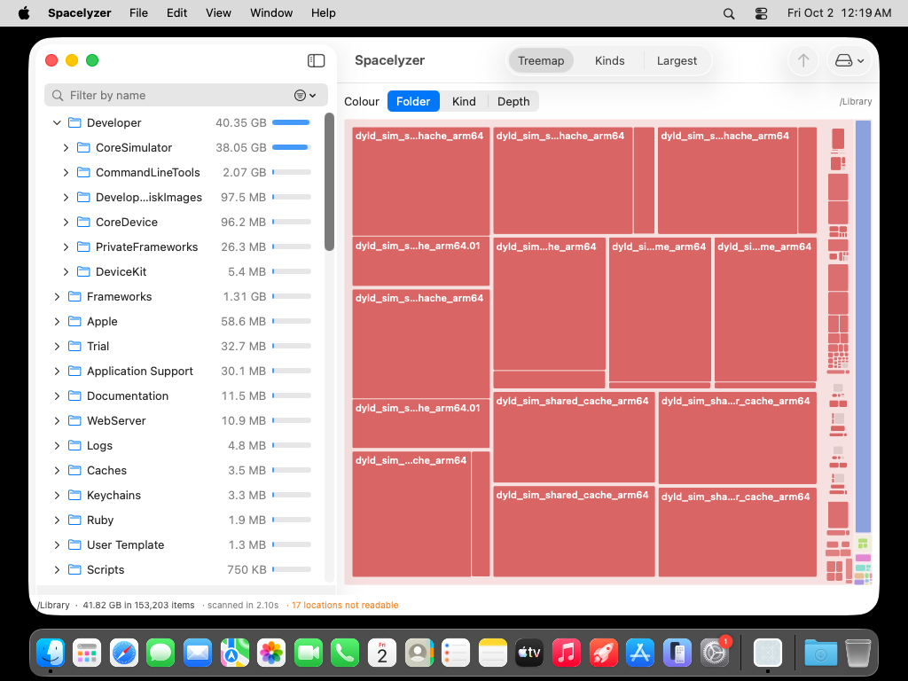
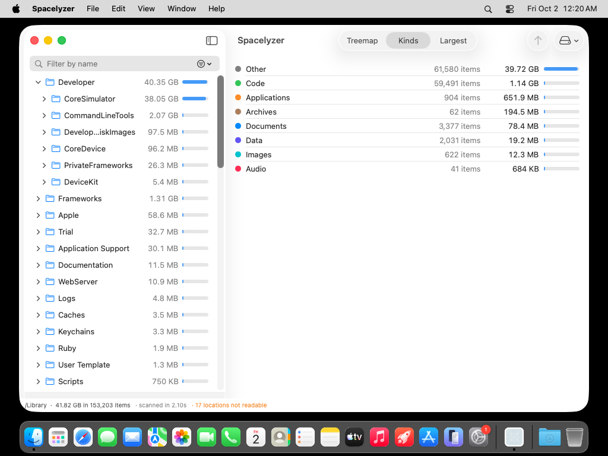
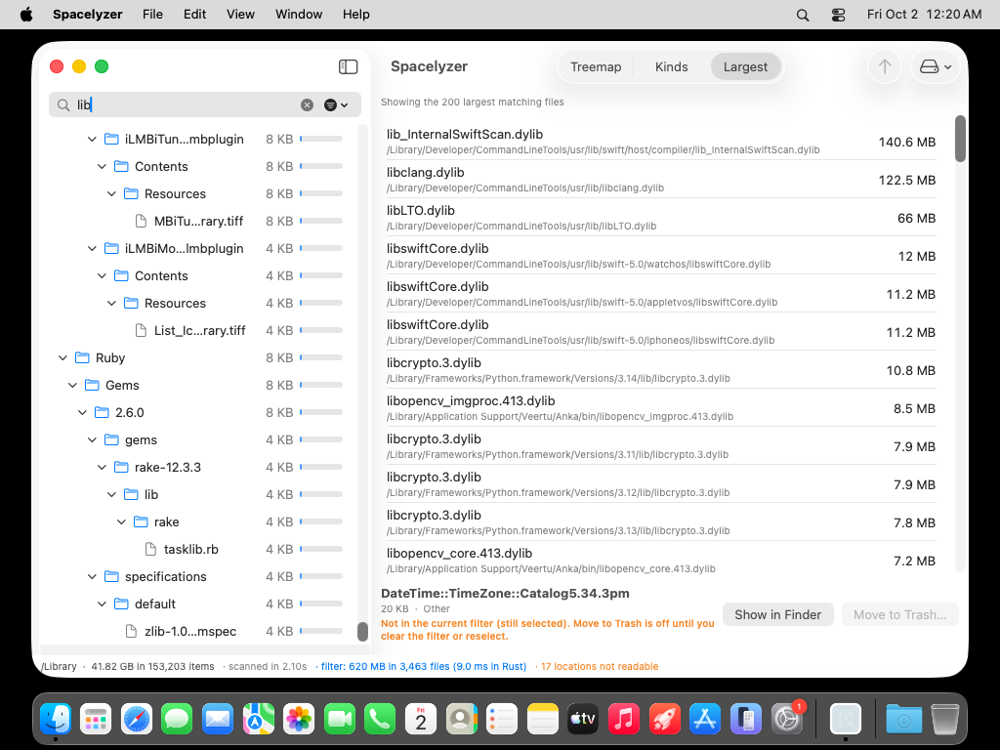
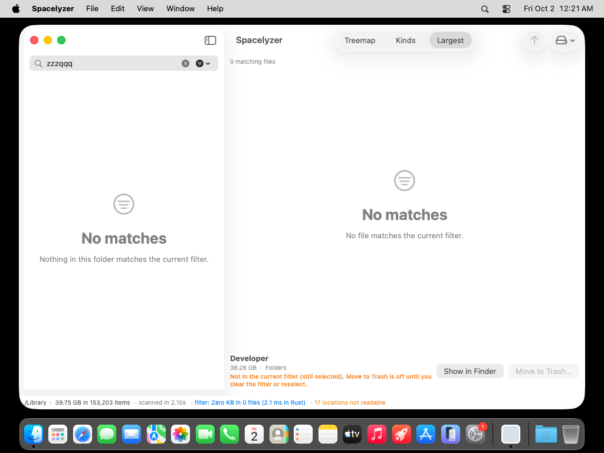

# Spacelyzer Native

See what is using your disk. A native macOS disk space analyzer: a SwiftUI interface on top of a Rust engine
built for speed.



*A scan of `/Library` (153,203 items, 41.82 GB, scanned in 2.1 s on a shared GitHub CI Mac). Screenshots in this
README come from CI at 1024x768, not from a personal Mac.*

## What you get

| | |
|---|---|
| **Outline** | Every folder and file with size and share bars, largest first by default; a sort menu offers size (either way), name, most items and recently modified. Folders show their item count when the sidebar is wide enough (>= 400 pt). Selecting a file hidden in collapsed folders expands its ancestors. Expand one folder or all 24,903 of them. Arrow keys move, Right/Left expand and collapse, Return drills in. |
| **Treemap** | Area equals size. Colour by folder, kind or depth. Hover for a readout, click to select, double-click to drill. Tiny items fold into one labelled remainder, nothing is dropped. |
| **Kinds** | Where the space goes by file type, ranked by size. |
| **Largest** | The 200 largest files, with full paths. The header says when the list is capped. |
| **Filter** | Name, extension, kind, minimum and maximum size, and a modified-date window (7 days, 30 days, year), combined; "Clear all filters" resets them. One filter drives every view, so the outline, treemap, Kinds and Largest always describe the same files. The status bar shows the match count and total. |
| **Trash** | Move to Trash after a confirmation that shows the full path, with undo. Protected system paths are refused. Items hidden by the filter cannot be removed. |





*Filter "lib": 3,463 matching files, 620 MB. The selected folder is outside the filter, so the app says so and keeps
Move to Trash off until you clear the filter or select something else.*



## How it is built

```
SwiftUI (visible rows and rectangles only)
        |  C ABI: small calls, flat arrays
Rust engine
  scan      parallel, getattrlistbulk on macOS
  tree      one flat arena, hard links counted once
  filter    parallel pass + roll-up to ancestors
  outline   flattened visible rows (no cap)
  layout    squarified treemap + hit-testing index
```

- **The UI thread only draws and handles input.** Scanning, filtering, outline projection, treemap layout, the Largest
  and Kinds lists all run in Rust off the main thread, are cancelled when superseded, and publish a single result.
  The previous picture stays up until the new one is ready.
- **Rust owns the data.** Dataset, filter, sort, aggregation, layout and hit-testing live in the engine. SwiftUI never
  holds a node per file: the outline is windowed, so only the visible rows get views.
- **Honest numbers.** Sizes are allocated bytes (block-rounded), like Finder's "Size on disk". Hard-linked files count once.

## Measured so far

All from a shared GitHub Actions Mac, one folder (`/Library`, 153k items). Informational, not a benchmark. No comparison
with any other disk analyzer has been run, so no speed-up claim is made.

| What | Rust engine | Notes |
|---|---|---|
| Scan, 153k items | about 2 s wall | includes disk and OS cache effects |
| Filter by name, 153k items | 10-20 ms | 1M synthetic nodes on a 2-core Linux box: 8-28 ms |
| Treemap layout, 215 rects | 0.1 ms | plus 0.05 ms to copy into Swift |
| Outline projection, 153k rows (everything expanded) | 18 ms | rows reach the UI in 40-106 ms after the windowed outline; 16.9 s before it |

The last row is how long until the rows arrived on the main thread, not a full redraw measurement.
Engine timings are reported separately from UI and copy timings.

## In development

E2 adaptive filter surface and action accessibility labels are committed but not yet compiled or visually verified. No VoiceOver or accessibility-mode pass is claimed.

## Verification status

E1 is not signed off. Diagnostic v0.1.89 failed its UI gate (26 of 28 checks reached); it is not a recommended delivery. Zero-byte filtering fixes passed independent engine review. Run37036910990 compiled and passed date/sort/reset effect checks, but failed one count-threshold check and missed later screenshots. Run37040037876 also failed image capture; runner-owned state/capture acknowledgement is under verification. Run37043128105 passed30 checks and produced22 images, but pixel review found missing visible depth12 count evidence. E1 still needs the corrected deep-row fixture and independent signoff.

Performance research: [index-assisted early results and dua-cli inspiration](docs/EVAL-index-accelerant.md), evaluation only. No Spotlight query or progressive result list is implemented.

## Get it

Download the DMG from the [latest release](https://github.com/k-electron-bots/spacelyzer-native/releases).

The build is **self-signed, not notarized**. macOS will block the first launch. Use System Settings > Privacy &
Security > scroll to Security > **Open Anyway** (the button stays for about an hour and asks for your login password).
Do not clear quarantine flags or turn Gatekeeper off. Full Disk Access (Privacy & Security) is needed for a complete
scan of protected folders; the app reports how many locations it could not read.

## Not done yet

Duplicate detection, exclusions UI and persistence, a reviewable skipped-items list, volume accounting (purgeable
space, snapshots), Quick Look and item details, batch removal and history, size-unit toggle, Full Disk Access detection,
app icon, VoiceOver pass. Not yet tested: real Mac behaviour at other window sizes and multi-volume setups. See
[docs/ROADMAP.md](docs/ROADMAP.md) for the ordered plan.

## Develop

```bash
cargo test --release -p spacelyzer-engine           # engine tests
cargo build --release && ./target/release/spz scan <path>
./scripts/build-engine.sh && swift build -c release  # macOS only
```

Read [AGENTS.md](AGENTS.md) first: threading rules, polish bar, destructive-action rules, how CI verifies the UI.
Dependencies are `libc` and `rayon` (plus rayon's own crates), see [docs/DEPENDENCIES.md](docs/DEPENDENCIES.md);
CI fails if anything else appears.

## License

MIT. See [LICENSE](LICENSE).


## Current edge-case checkpoint (not signed off)

Unicode-lowercase name and extension matching now agrees with name sorting (no Unicode normalization or full case folding promised). Filtered Largest and Kinds keep zero-byte matches by item count; zero-area treemap regions remain absent by design. Engine coverage adds empty/missing/file roots, unusual names, sparse and zero-byte hardlinks, inverted/extreme filters, depth and exact parent/name identity, inclusive dates, mixed-case extensions, invalid FFI buffers/IDs and independent reproducers.32 engine tests pass locally on Linux; native macOS execution is pending.

Async filter, outline and derived publication checks cancellation, generation and tree identity inside the main actor. Scan progress/completion checks scan generation and session identity. CI adds token-specific barriers that hold old computed work across newer-filter completion, tree clearing and a different arena with reused node IDs, then verify completion did not replace current state. This is uncompiled and unexecuted until the macOS checkpoint, not race signoff.

The consolidated checkpoint expects44 assertions and30 captured states, including actual submenu attachment, exact large-folder exclusion and depth12 projection, light/dark minimum960x600, injected live Reduce Transparency/Motion toggles, keyboard selection and restoration. Pixels still decide: prior E1 submenu/deep images failed. Injected environments are not OS preference or VoiceOver proof. No E1/E2 completion or release-readiness claim before independent review. Permission-denied/mount/volume races, leak accounting, real VoiceOver, accent normalization and real hardware performance remain open; no exhaustive-edge claim.


Run94 (abdf1e8) passed engine jobs but stopped at Swift compilation: NSMenu.isAttached requires a call, and system accessibility environment keys are read-only. The repair uses optional, writable SPZ_DEMO override keys; nil inherits live OS values in normal operation. No UI screenshots or race runtime results came from run94. The repaired consolidated checkpoint is still pending; E1 and E2 stay open.


Run95 passed engine jobs and stopped at Swift compilation because NSMenu.isAttached() is unavailable on current macOS. Removed the unavailable API; parent highlighted identity is a tracking diagnostic only, never submenu visibility proof. Actual submenu pixels remain mandatory and unverified. No runtime evidence/artifacts came from95. Added two controlled real-session overlapping scan regressions: old progress and old completion are held while a newer scan completes, then released; identity, revisions, bytes/items, elapsed/result time, error and scanning state must remain current. Pending macOS execution. Next combined scope is46 assertions/30 images and32 engine tests, no exhaustive testing or readiness claim.


Independent source review caught a progress-barrier false-positive: multiple callbacks share one scan generation. Every publication now carries a unique UUID; after-hook completion must identify the parked invocation, and each regression checks that it is incomplete before release. Replacement-root expectation comes from the previously scanned replacement Tree.path(0), with non-nil checks, not independent path normalization. Source review/runtime remains pending;46 assertion scope unchanged.


Run96 at eb2010d compiled the universal Swift app and passed32 engine tests on Linux/macOS.46 UI results:43 PASS,3 FAIL. All6 UUID publication barriers passed, including overlapping real scan progress/completion.30 images exist. Exact large-folder exclusion/depth12 projection and actual399/401 deep/empty/10,001 count checks passed; inspected images show the deep rows and aligned counts. Five E2 mode/labels/keyboard/restoration checks passed with injected preferences; source and injected modes do not prove real OS notifications or VoiceOver.

Remaining failures are submenu tracking23/24/25 (highlighted=nil). Actual screenshots show only root filter/sort menus, no choice submenus. E1 remains open and no release-readiness claim is made. Independent artifact review is pending. Do not weaken this gap into root-menu/source/effect coverage; no immediate harness-only full rerun. Artifact: https://github.com/k-electron-bots/spacelyzer-native/actions/runs/37057037990/artifacts/11249012822 . This is diagnostic CI evidence, not a delivered release.


Next substantive E2 slice, committed but uncompiled/unverified: folder counts use selected control text on emphasized rows, secondary text normally and primary label with Increase Contrast. Native display-options notification and effective-appearance change refresh the cell colors. Full path tooltips preserve deep-name identity. CI-only contrast override is ignored in normal operation. Plan selected/unselected light/dark/increased-contrast images31-34; log alpha-composited semantic-color contrast against a background proxy, not a rendered WCAG verdict. Minimum check now verifies960x600, with narrow Tab/focus, Escape/no-effects and single-selection contracts. These do not claim a complete AX tree, actual OS preference notifications, motion behavior, older-macOS fallback or VoiceOver.

The failed submenu action dispatch is replaced in the pending harness by native tracked-menu down/right keyboard events; parent highlight remains diagnostic only. Actual choice submenu pixels are still required. Planned consolidated scope53 assertions/34 images; no new checkpoint until independent source review and parent coordination.


Independent source review accepts count color refresh/reuse, not runtime. Focused harness corrections: Tab must reach the next visible key-view identity (or its field editor), Escape starts without pending removal/message and preserves both, submenu navigation normalizes with Home then counts only enabled/nonhidden selectable items. Actual focus/menu pixels and runtime remain pending.53-check/34-image scope unchanged; no real OS, motion, AX-tree or older-OS signoff.


Run97 at50b0235 compiled/passed engine jobs and captured34 images.49PASS/1FAIL of50 written, expected53. Actual choice submenu pixels23-25 now show date/max/sort options; tracking diagnostics pass. Count selected/unselected light/dark/injected Increase Contrast contracts and pixels31-34 pass narrow scope, independent review pending. Sampled repeated core count-ink contrast versus adjacent flat background: selected light5.430/dark6.235, normal light3.949/dark5.925, increased light14.353/dark12.274; not a formal compliance/every-antialiasing-edge guarantee.

Minimum-height assertion failed: measured contentView960x652, not960x600. Need authoritative layout-content/root measurement, not width-only acceptance. Final Tab/Escape/single-selection assertions did not reach file because runner killed app immediately after capturing34. App alive at end/no crash artifact. Explicit demo-finished handshake repaired in source, unexecuted; final focus checks remain unverified. No immediate harness-only rerun/readiness. Artifact https://github.com/k-electron-bots/spacelyzer-native/actions/runs/37060726827/artifacts/11250503094 .


Independent scoped E1 acceptance is achieved across checkpoints through run97 submenu choice pixels; this is not whole-run97/E2/release approval. E2 selected-count readability and injected branch layout accepted visually; raw contrast audit now preserves originals, fixed crops/background coordinates, full qualifying-color frequencies and executable method for independent reproduction, not formal compliance.

Next product refinement, pending source review/runtime: unselected count uses primary labelColor universally; selected count retains selected control text. Size/path hierarchy remains separate. Inactive selection and row reload/reuse color contracts/screens35-36 planned. Minimum check measures actual SwiftUI root and contentLayoutRect against960x600 while logging contentView/chrome separately; raw960x652 does not waive600 layout fit. Explicit demo-finished handshake waits for final focus assertions before teardown. Planned55 assertions/36 images; no CI or readiness until coordinated checkpoint. Actual OS, motion, olderOS and VoiceOver gaps remain.


Independent cumulative source review accepts fail-closed final handshake and minimum root/layout logging, runtime still decides. Inactive/reactivated selection checks now preserve model-node/table-row identity before/after focus changes. State36 is visible reload/reselect color evidence, not offscreen recycled-cell reuse; named accordingly.55 assertions/36 states unchanged, pending coordinated checkpoint. Offscreen reuse, actual OS and full E2 signoff not claimed.


Run98 at12a251f compiled and passed engine jobs.53PASS/2FAIL of55,36 captured states, final completion handshake worked. Root960x600 and contentLayoutRect960x600 passed while contentView960x652 includes unified chrome; actual26 fit pixels await independent review. Primary count31-34 and inactive35 branches pass narrow color/identity contracts. Visible reload36 and exact Tab destination fail.36 shows gray inactive selection after reactivation, so do not claim active reload color coverage or blame product focus without responder/key-window evidence. Escape and single-selection final checks pass. Add explicit responder/window/node/row diagnostic details before next coordinated slice, not an immediate harness-only rerun. E1 accepted across96/97 and new menu regression checks pass, not full E2/release approval. Artifact https://github.com/k-electron-bots/spacelyzer-native/actions/runs/37064592633/artifacts/11252766224 .


Next substantive consistency/safety slice (uncompiled/unexecuted): Swift now uses existing spz_filter_count for filter membership. Previously SelectionBar and removal guard treated zero allocated bytes as outside-filter, wrongly warning/blocking matching zero-byte files even though outline/Largest kept them. New disposable zero-byte fixture checks count1/bytes0, hidden nonmatch refusal, matching confirmation and one mocked Trash call; no user files are touched. Pending56-contract/36-image checkpoint, not permission to remove anything without confirmation.

Treemap async publication now checks cancellation, generation and current tree/root/filter/size inside main actor, invalidates on disappear, clears hover on relayout and rejects interactions/readouts from stale root/filter/size or foreign-tree layout. Previous picture may stay visible while new same-tree layout computes, but cannot select from stale coordinates. This is source hardening, not reproduced runtime race or deterministic treemap barrier proof yet. Existing32 engine tests pass locally, no engine behavior changed. Focus diagnostics include selected cell backgroundStyle; failed Tab/active reload expectations unchanged pending real responder diagnosis. No CI run yet, E2/release remains open.


Independent source review accepts count-based zero-byte membership semantics with pending/protected guards unchanged, mocked Swift execution pending. Treemap repair also stamps model.revision, rejecting in-place forget mutations before relayout. No-matches overlay uses only current layout and a settled filter, so an old empty layout cannot claim the new filter has no matches. Still source-only treemap acceptance, not one of six previously proven cache interleavings. Focus failure causes remain diagnostic/open. No readiness.


Treemap zero-area semantics repair: settled current layout with no rects shows No matches only when activeFilter.count(displayedRoot)==0. Matching zero-byte-only items instead show a truthful no drawable allocated space state, directing to outline/Largest. Root-local count, never global filter count, owns this distinction. Disposable zero-byte fixture asserts root count1 with zero rects and excluded-file count0.57 planned contracts; Swift runtime/pixels pending, no CI or readiness claim.


Independent38b271d source accepts root-local zero-area distinction and retained guards. The fixture assertion is named zero-match-root-count-and-layout-data-contract: it proves count/rect data, not an instantiated SwiftUI zero-area message or pixels. Combined checkpoint includes mocked zero-byte removal regression and unchanged two failing focus/reload contracts with more diagnosis.57 results/36 states, no source-only E2 or treemap race proof/readiness.


Run99 at554321c compiled/passed engine jobs.55PASS/2FAIL of57,36 images, app alive/final handshake complete. Both zero-byte fixture contracts pass: rootcount1/rects0 data, matching warning/removal policy confirms once through mock while nonmatch stays blocked. This is not SwiftUI zero-area-state pixel proof. Treemap revision/current gates compile, not forced-interleaving race proof.

Same two focus gates fail with useful diagnostics: visible reload key=false despite makeKeyAndOrderFront, preserved node1/row0, inactive labelColor. Tab key=false, intended nextValidKeyView=nil, responder becomes SwiftUIOutlineListView and selection remains1. Active restoration precondition and exact intended Tab destination are absent; cause/product defect not established. Expectations remain unchanged. Full36 shows neutral readable inactive selection; date submenu23 remains visible. No immediate harness-only rerun, E2/release not approved. Artifact https://github.com/k-electron-bots/spacelyzer-native/actions/runs/37067135227/artifacts/11253697318 .


Next substantive native focus slice, uncompiled/unverified: name filter is an NSTextField bridge with same model debounce, accessible label and native field editor. Weak model references explicitly connect outline nextKeyView to named visible filter across hosting boundary. Normal Tab then ShiftTab must reach exact field/editor and outline identities with selection unchanged. CI requests NSApp.activate(), waits up to5s and requires actual appactive/windowkey/successful makeFirstResponder(table) before active reload/focus checks. Activation request is not guarantee; missing setup stays failure/blocker, never PASS. Previous key=false/nil intended destination did not establish product cause/exoneration.

Disposable SwiftUI zero-area and no-match fixture states37/38 now included: count/size setup assertions are distinct from actual pixels, which must show truthful messages.60 results38 states planned; no CI until independent source review/coordination. Previous E1/six specific cache barriers accepted, treemap forced race/actualOS/olderOS/VoiceOver/full E2/readiness gaps retained.


Independent focus source review requested attachment/parity corrections before checkpoint. Product field/table now reconnect on viewDidMoveToWindow, preserving any forward chain beyond the field. Demo observes established next/previous valid identities, never calls product bridge repair. ShiftTab requires successful forward field start; reload gate rechecks actual active/key/table responder at assertion time. Native editor model sync preserves cursor selection and avoids overwriting marked text. Four narrow editor API regressions plan typing, external text/cursor, clear-all while editing and marked-text commit simulation; simulation is not actual IME/keyboard-source proof.64 planned contracts38 states, uncompiled/unexecuted and no CI yet. Full pixels37/38, activation/focus runtime, actual OS/olderOS/VoiceOver and treemap race gaps retained.
